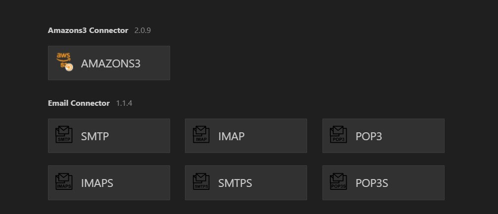

# WSO2MI

WSO2 Micro Integrator is a lightweight, cloud-native, and decentralized integration platform that allows you to
integrate services, systems, and data sources. It is based on the popular open-source project Apache Synapse. WSO2 Micro
Integrator is a cloud-native, lightweight, and decentralized integration platform that allows you to integrate services,
systems, and data sources. It is based on the popular open-source project Apache Synapse. WSO2 Micro Integrator is a
cloud-native, lightweight, and decentralized integration platform that allows you to integrate services, systems, and
data sources. It is based on the popular open-source project Apache Synapse.

### Topics

* [Message Routing](#message-routing)
* [Message Transformation](#message-transformation)
* [Message Processing](#message-processing)
* [Service Orchestration](#service-orchestration)
* [Asynchronous Messaging Processing](#asynchronous-messaging-processing)
* [Protocol Switching](#protocol-switching)
* [SaaS and B2B Integration](#saas-and-b2b-integration)
* [Data Integration](#data-integration)
* [File Processing](#file-processing)
* [Periodic Execution](#periodic-execution)
* [Rest API](#rest-api)
* [Websocket](#websocket)
* [Webhook](#webhook)
* [Proxy Service](#proxy-service)
* [Inbound Endpoint](#inbound-endpoint)
* [Local Entry](#local-entry)
* [Template](#template)
* [Message Store](#message-store)
* [Message Processor](#message-processor)
* [Endpoint](#endpoint)
* [Sequence](#sequence)

### Message Transformation

* Transform the message from one format to another format.

**From**

```json
{
  "name": "John Doe",
  "dob": "1940-03-19",
  "ssn": "234-23-525",
  "address": "California",
  "phone": "8770586755",
  "email": "johndoe@gmail.com",
  "doctor": "thomas collins",
  "hospital_id": "grandoaks",
  "hospital": "grand oak community hospital",
  "cardNo": "7844481124110331",
  "appointment_date": "2017-04-02"
}
```

**To**

```json
{
  "patient": {
    "name": "John Doe",
    "dob": "1990-03-19",
    "ssn": "234-23-525",
    "address": "California",
    "phone": "8770586755",
    "email": "johndoe@gmail.com",
    "cardNo": "7844481124110331"
  },
  "doctor": "thomas collins",
  "hospital_id": "grandoaks",
  "hospital": "grand oak community hospital",
  "appointment_date": "2017-04-02"
}
```

### Transform Json To SOAP

our backend is a soap application but we want to talk to it in json

#### Run Soap Project and Test it

```
cd jars/axis2Server/bin/
./axis2server.bat
```

#### use payload factory

the payload factory will take the format that he will send to the backend which is the `xml of soap` then provide
`arguments` to be replaced in this **xml**.

**PayloadFactory**

```xml

<payloadFactory media-type="xml | json" template-type="default | freemarker">
    <format>

    <format/>
</payloadFactory>
```

**payload**
the payload is the xml of the soap message, which will be sent to the backend

```xml

<soapenv:Envelope xmlns:soapenv="http://schemas.xmlsoap.org/soap/envelope/" xmlns:ser="http://services.samples"
                  xmlns:xsd="http://services.samples/xsd">
    <soapenv:Header/>
    <soapenv:Body>
        <ser:placeOrder>
            <ser:order>
                <xsd:symbol>$1</xsd:symbol>
                <xsd:price>$2</xsd:price>
                <xsd:quantity>$3</xsd:quantity>
            </ser:order>
        </ser:placeOrder>
    </soapenv:Body>
</soapenv:Envelope>
```

**Arguments**
`expression` is the path of the value in the json payload
`evaluator` is the type of the value in the json payload

```xml

<args>
    <arg expression="$.placeOrder.order.symbol" evaluator="json"/>
    <arg expression="$.placeOrder.order.price" evaluator="json"/>
    <arg expression="$.placeOrder.order.quantity" evaluator="json"/>
</args>
```

**Json Payload**

```json
{
  "placeOrder": {
    "order": {
      "symbol": "IBM",
      "price": 34.5,
      "quantity": 1000
    }
  }
}
```

**Endpoint**

Endpoint should be of type `address` and the uri should be the backend uri

```xml

<call>
    <endpoint key="SimpleStockEp"/>
</call>
```

### Property Mediator

The property mediator ensures that the response is converted back into JSON before sending it to the client.
WSO2 uses the `messageType` property to determine the `Content-Type` of the response.

**OR**

Manipulates message properties by setting and/or removing property values, supporting both constant and dynamically
generated values through XPath expressions.

> Used in our example to force the content type to be `application/json` because the backend is a soap application but
> we
> want to talk to it in json

#### Why Is This Property Mediator Used?

After the `<call>` mediator sends the SOAP request to `SimpleStockEp`, the response received is in `SOAP/XML` format.

**Attributes:**

`name` is the name of the property,

`action` is the action to be performed on the property. The possible values are `set` and `remove`.

`DataType` is the type of the property value. The possible values are `STRING`, `INTEGER`, `FLOAT`, `DOUBLE`, `BOOLEAN`,

**`expression`**

When specifying a `JSONPath`, use the format `json-eval(<JSON_PATH>)` , such as `json-eval(getQuote.request.symbol)`. In
both
`XPath` and `JSONPath` expressions, you can return the value of another property by calling
`get-property(property-name)`. For
example, you might create a property called `JSON_PATH` of which the value is `json-eval(pizza.toppings)` , and then you
could create another property called `SON_PRINT` of which the value is `get-property('JSON_PATH')`, allowing you to use
the
value of the `JSON_PATH` property in the `JSON_PRINT` property.

**`Scope`**



#### Property Mediator Examples with `Scope`:

#### Synapse Scope (Default)

This is used for properties that should last throughout the entire request-response lifecycle.

```xml
<!-- Setting a value to use later in the same message flow -->
<property name="requestID" value="REQ-12345" scope="default"/>

        <!-- Later in the sequence, accessing the property -->
<log level="custom">
<property name="RequestIdentifier" expression="get-property('requestID')"/>
</log>
```

#### Transport Scope

Used for setting transport headers, especially useful for HTTP/HTTPS endpoints.

```xml
<!-- Setting a custom HTTP header for an outgoing request -->
<property name="CustomHeader" value="CustomValue" scope="transport"/>

        <!-- Setting multiple transport headers for REST calls -->
<property name="Content-Type" value="application/json" scope="transport"/>
<property name="Authorization" value="Bearer token123456" scope="transport"/>
```

#### What is Axis2 ?

**Apache Axis2** is a web services engine used to create and consume **`SOAP` (Simple Object Access Protocol)** and
RESTful
web services. It is a successor to `Apache Axis1` and is designed to be more efficient, flexible, and extensible.

#### Axis2 Scope

Used for interacting with the underlying Axis2 engine parameters.

```xml
<!-- Configure message formatting -->
<property name="messageType" value="application/json" scope="axis2"/>

        <!-- Disable chunking for the message -->
<property name="DISABLE_CHUNKING" value="true" scope="axis2"/>
```

#### Axis2-Client Scope

Similar to Synapse but accessible from custom mediators.

```xml
<!-- Setting timeout parameters -->
<property name="TIMEOUT_CONNECTION" value="10000" scope="axis2-client"/>
<property name="TIMEOUT_SOCKET" value="10000" scope="axis2-client"/>

        <!-- Set client options for WS-Security -->
<property name="rampart.config" value="path/to/policy.xml" scope="axis2-client"/>
```

#### Operation Scope

For accessing properties later at the operation context level.

```xml
<!-- Store operation-specific data -->
<property name="operationID" value="OP-12345" scope="operation"/>

        <!-- Later in mediation, retrieve this value -->
<log>
<property name="Current Operation" expression="get-property('operation', 'operationID')"/>
</log>
```

#### Registry Scope

```xml
<!-- Retrieve configuration from registry -->
<property name="endpointConfig" expression="get-property('registry', 'conf:/endpoints/production.xml')"
          scope="default"/>
```

#### System Scope

Retrieve Java system properties.
This scope is used to retrieve Java system properties ('system').

```xml
<!-- Get Java system properties -->
<log level="custom">
    <property name="JavaVersion" expression="get-property('system', 'java.version')"/>
    <property name="OSName" expression="get-property('system', 'os.name')"/>
</log>
```

#### Environment Scope

Retrieve environment variables.
This scope is used to retrieve environment variables ('env').

```xml
<!-- Get environment variables -->
<log level="custom">
    <property name="HomePath" expression="get-property('env', 'HOME')"/>
    <property name="JavaHome" expression="get-property('env', 'JAVA_HOME')"/>
</log>
```

#### File Scope

Retrieve properties from application.properties configuration file.
This scope is used to retrieve properties defined in the `file.properties` configuration file ('file').

```xml
<!-- Assuming file.properties contains: database.url=jdbc:mysql://localhost:3306/mydb -->
<log level="custom">
    <property name="DBUrl" expression="get-property('file', 'database.url')"/>
</log>
```

### Example

#### Error Handling

```xml
<!-- Store original payload before transformation -->
<property name="originalPayload" expression="$body" scope="default"/>
        <!-- In fault sequence, retrieve original -->
<payloadFactory>
<format>
    <error>
        <message>Processing failed</message>
        <originalRequest>$1</originalRequest>
    </error>
</format>
<args>
    <arg expression="get-property('originalPayload')"/>
</args>
</payloadFactory>
```


