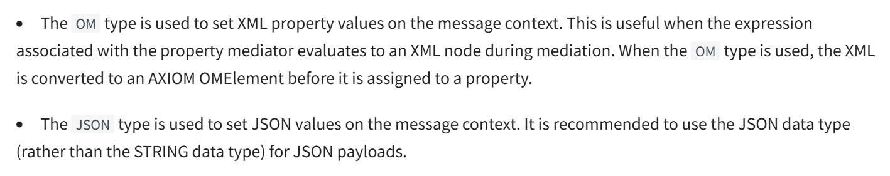

# WSO2MI

WSO2 Micro Integrator is a lightweight, cloud-native, and decentralized integration platform that allows you to
integrate services, systems, and data sources. It is based on the popular open-source project Apache Synapse. WSO2 Micro
Integrator is a cloud-native, lightweight, and decentralized integration platform that allows you to integrate services,
systems, and data sources. It is based on the popular open-source project Apache Synapse. WSO2 Micro Integrator is a
cloud-native, lightweight, and decentralized integration platform that allows you to integrate services, systems, and
data sources. It is based on the popular open-source project Apache Synapse.


### Message Transformation

* Transform the message from one format to another format.

**From**

```json
{
  "name": "John Doe",
  "dob": "1940-03-19",
  "ssn": "234-23-525",
  "address": "California",
  "phone": "8770586755",
  "email": "johndoe@gmail.com",
  "doctor": "thomas collins",
  "hospital_id": "grandoaks",
  "hospital": "grand oak community hospital",
  "cardNo": "7844481124110331",
  "appointment_date": "2017-04-02"
}
```

**To**

```json
{
  "patient": {
    "name": "John Doe",
    "dob": "1990-03-19",
    "ssn": "234-23-525",
    "address": "California",
    "phone": "8770586755",
    "email": "johndoe@gmail.com",
    "cardNo": "7844481124110331"
  },
  "doctor": "thomas collins",
  "hospital_id": "grandoaks",
  "hospital": "grand oak community hospital",
  "appointment_date": "2017-04-02"
}
```

### Transform Json To SOAP

our backend is a soap application but we want to talk to it in json

#### Run Soap Project and Test it

```
cd jars/axis2Server/bin/
./axis2server.bat
```

#### use payload factory

the payload factory will take the format that he will send to the backend which is the `xml of soap` then provide
`arguments` to be replaced in this **xml**.

**PayloadFactory**

```xml

<payloadFactory media-type="xml | json" template-type="default | freemarker">
    <format>

    <format/>
</payloadFactory>
```

**Payload**  **Body**
the payload is the xml of the soap message, which will be sent to the backend

```xml

<soapenv:Envelope xmlns:soapenv="http://schemas.xmlsoap.org/soap/envelope/" xmlns:ser="http://services.samples"
                  xmlns:xsd="http://services.samples/xsd">
    <soapenv:Header/>
    <soapenv:Body>
        <ser:placeOrder>
            <ser:order>
                <xsd:symbol>$1</xsd:symbol>
                <xsd:price>$2</xsd:price>
                <xsd:quantity>$3</xsd:quantity>
            </ser:order>
        </ser:placeOrder>
    </soapenv:Body>
</soapenv:Envelope>
```

**Arguments**
> It will take the arguments from json to pass it as argument to xml 

`expression` is the path of the value in the json payload
`evaluator` is the type of the value in the json payload

```xml

<args>
    <arg expression="$.placeOrder.order.symbol" evaluator="json"/>
    <arg expression="$.placeOrder.order.price" evaluator="json"/>
    <arg expression="$.placeOrder.order.quantity" evaluator="json"/>
</args>
```

**Json Payload**

```json
{
  "placeOrder": {
    "order": {
      "symbol": "IBM",
      "price": 34.5,
      "quantity": 1000
    }
  }
}
```

**Endpoint**

Endpoint should be of type `address` and the uri should be the backend uri

```xml

<call>
    <endpoint key="SimpleStockEp"/>
</call>
```


### Property Mediator

The property mediator ensures that the response is converted back into JSON before sending it to the client.
WSO2 uses the `messageType` property to determine the `Content-Type` of the response.

**OR**

Manipulates message properties by setting and/or removing property values, supporting both constant and dynamically
generated values through XPath expressions.

> Used in our example to force the content type to be `application/json` because the backend is a soap application but
> we
> want to talk to it in json

#### Why Is This Property Mediator Used?

After the `<call>` mediator sends the SOAP request to `SimpleStockEp`, the response received is in `SOAP/XML` format and we want to get response as json.

**Attributes:**

`name` is the name of the property,

`action` is the action to be performed on the property. The possible values are `set` and `remove`.

`DataType` is the type of the property value. The possible values are `STRING`, `INTEGER`, `FLOAT`, `DOUBLE`, `BOOLEAN`,
`OM`,`JSON`.



**`expression`**

When specifying a `JSONPath`, use the format `json-eval(<JSON_PATH>)` , such as `json-eval(getQuote.request.symbol)`. In
both
`XPath` and `JSONPath` expressions, you can return the value of another property by calling
`get-property(property-name)`. For
example, you might create a property called `JSON_PATH` of which the value is `json-eval(pizza.toppings)` , and then you
could create another property called `SON_PRINT` of which the value is `get-property('JSON_PATH')`, allowing you to use
the
value of the `JSON_PATH` property in the `JSON_PRINT` property.

**`Scope`**


#### Property Mediator Examples with `Scope`

#### Synapse Scope (Default)

This is used for properties that should last throughout the entire request-response lifecycle.

```xml
<!-- Setting a value to use later in the same message flow -->
<property name="requestID" value="REQ-12345" scope="default"/>

        <!-- Later in the sequence, accessing the property -->
<log level="custom">
<property name="RequestIdentifier" expression="get-property('requestID')"/>
</log>
```

#### Transport Scope

Used for setting transport headers, especially useful for HTTP/HTTPS endpoints.

```xml
<!-- Setting a custom HTTP header for an outgoing request -->
<property name="CustomHeader" value="CustomValue" scope="transport"/>

        <!-- Setting multiple transport headers for REST calls -->
<property name="Content-Type" value="application/json" scope="transport"/>
<property name="Authorization" value="Bearer token123456" scope="transport"/>
```

#### What is Axis2 ?

**Apache Axis2** is a web services engine used to create and consume **`SOAP` (Simple Object Access Protocol)** and
RESTful
web services. It is a successor to `Apache Axis1` and is designed to be more efficient, flexible, and extensible.

#### Axis2 Scope

Used for interacting with the underlying Axis2 engine parameters.

```xml
<!-- Configure message formatting -->
<property name="messageType" value="application/json" scope="axis2"/>

        <!-- Disable chunking for the message -->
<property name="DISABLE_CHUNKING" value="true" scope="axis2"/>
```

#### Axis2-Client Scope

Similar to Synapse but accessible from custom mediators.

```xml
<!-- Setting timeout parameters -->
<property name="TIMEOUT_CONNECTION" value="10000" scope="axis2-client"/>
<property name="TIMEOUT_SOCKET" value="10000" scope="axis2-client"/>

        <!-- Set client options for WS-Security -->
<property name="rampart.config" value="path/to/policy.xml" scope="axis2-client"/>
```

#### Operation Scope

For accessing properties later at the operation context level.

```xml
<!-- Store operation-specific data -->
<property name="operationID" value="OP-12345" scope="operation"/>

        <!-- Later in mediation, retrieve this value -->
<log>
<property name="Current Operation" expression="get-property('operation', 'operationID')"/>
</log>
```

#### Registry Scope

```xml
<!-- Retrieve configuration from registry -->
<property name="endpointConfig" expression="get-property('registry', 'conf:/endpoints/production.xml')"
          scope="default"/>
```

#### System Scope

Retrieve Java system properties.
This scope is used to retrieve Java system properties ('system').

```xml
<!-- Get Java system properties -->
<log level="custom">
    <property name="JavaVersion" expression="get-property('system', 'java.version')"/>
    <property name="OSName" expression="get-property('system', 'os.name')"/>
</log>
```

#### Environment Scope

Retrieve environment variables.
This scope is used to retrieve environment variables ('env').

```xml
<!-- Get environment variables -->
<log level="custom">
    <property name="HomePath" expression="get-property('env', 'HOME')"/>
    <property name="JavaHome" expression="get-property('env', 'JAVA_HOME')"/>
</log>
```

#### File Scope

Retrieve properties from application.properties configuration file.
This scope is used to retrieve properties defined in the `file.properties` configuration file ('file').

```xml
<!-- Assuming file.properties contains: database.url=jdbc:mysql://localhost:3306/mydb -->
<log level="custom">
    <property name="DBUrl" expression="get-property('file', 'database.url')"/>
</log>
```

#### Example

#### Error Handling

```xml
<!-- Store original payload before transformation -->
<property name="originalPayload" expression="$body" scope="default"/>
        <!-- In fault sequence, retrieve original -->
<payloadFactory>
<format>
    <error>
        <message>Processing failed</message>
        <originalRequest>$1</originalRequest>
    </error>
</format>
<args>
    <arg expression="get-property('originalPayload')"/>
</args>
</payloadFactory>
```

### Registry

**What is registry?**  The registry is a storage space for artifacts that are used in the `ESB`. It is a centralized

### Local Registry Entry

The local registry acts as a memory registry where you can store static content as a key-value pair. This could be a
static text specified as inline text, static XML specified as an inline XML fragment, or a URL (using the src
attribute).

**Plain Text**

```xml

<localEntry key="version" xmlns="http://ws.apache.org/ns/synapse">0.1</localEntry>
```

**XML**

```xml

<localEntry key="validate_schema" xmlns="http://ws.apache.org/ns/synapse">
    <xs:schema xmlns:xs="http://www.w3.org/2001/XMLSchema">
        ...
    </xs:schema>
</localEntry>
```

**URL**

```xml

<localEntry key="payload" xmlns="http://ws.apache.org/ns/synapse"
            src="file:repository/samples/resources/transform/transform.xslt"/>
```

### Header Mediator

The header mediator is used to add, remove, or modify HTTP headers in the message. It can be used to set custom headers

#### Configuration

**`name`**  The name of the header to be added, removed, or modified.

**`action`** can be `set` or `remove`.

**`scope`** can be `transport` or `default`.

**`value`**  The value of the header to be added.

**`value type`** can be `LITERAL` or `EXPRESSION` or `INLINE`.

##### Scope

Select `Synapse` if you want to manipulate **SOAP headers**. Select `Transport` if you want to manipulate **HTTP headers
**.

##### Value

**Value Expression**

Static value or an **XPath** `XML Path`/**JSONPath** `JSON PATH` expression that will be executed on the message to set
the header value.

**`Inline`**

This parameter allows you to directly `input any XML syntax`  to the Header mediator **(specifically for SOAP
headers)**.

#### Example

**Http Header**

```xml

<inSequence>
    <header name="Accept" value="image/jpeg" scope="transport"/>
    <call>
        <endpoint name="people">
            <address uri="http://localhost:9763/people/eric+cooke" format="get"/>
        </endpoint>
    </call>
    <respond/>
</inSequence>
```

**Soap Header**

> #### URN
>
>Uniform Resource Name (URN) that specifies the action to be performed in a SOAP request. In this case, urn:getQuote
> likely refers to a specific operation or method that the SOAP service should execute,

```xml

<inSequence>
    <header name="To" value="http://localhost:8280/services/SimpleStockQuoteService" scope="default"/>
    <header name="Action" value="urn:getQuote" scope="default"/>
    <call>
        <endpoint key="SimpleStockEp"/>
    </call>
    <respond/>
</inSequence>
```

```xml

<resource methods="GET" uri-template="/getQuote">
    <inSequence>
        <property name="REQUEST_HEADER" scope="default" type="OM">
            <p1:Code xmlns:p1="http://www.XYZ.com/XSD">XYZ</p1:Code>
        </property>


        <header name="p1:Code" scope="default" expression="$ctx:REQUEST_HEADER" xmlns:p1="http://www.XYZ.com/XSD"/>
        <call>
            <endpoint key="SimpleStockQuoteServiceEP"/>
        </call>
        <!-- Setting a complex XML structure as a SOAP header for the response -->
        <property name="RESPONSE_HEADER" scope="default" type="OM">
            <p2:Header xmlns:p2="http://www.ABC.com/XSD">
                <p2:Hello>World</p2:Hello>
            </p2:Header>
        </property>
        <header name="p2:Header" xmlns:p2="http://www.ABC.com/XSD" action="set" scope="default"
                expression="$ctx:RESPONSE_HEADER"/>

        <respond/>
    </inSequence>
</resource>
```

#### Explain

> This Header added before the call to the endpoint

> Defined in default scope to be used later
> The type is OM because it will be header from XML

```xml

<property name="REQUEST_HEADER" scope="default" type="OM">
    <p1:Code xmlns:p1="http://www.XYZ.com/XSD">XYZ</p1:Code>
</property>
```

> #### `$ctx`: Prefix
> `$ctx`: is a special prefix used in WSO2 MI that **refers to the message context**.

> When you use `$ctx:REQUEST_HEADER`, you're
> retrieving a > property named `"REQUEST_HEADER"` that was previously stored in the message context using the property
> mediator.
>


> `p1:Code` is the prefix and value of the previous header property
> `p1` is a namespace prefix that refers to the namespace `http://www.XYZ.com/XSD` in the header property.

```xml

<header name="p1:Code" scope="default" expression="$ctx:REQUEST_HEADER" xmlns:p1="http://www.XYZ.com/XSD"/>
```

* This is Stored Header to be used later in the response

```xml
        <!-- Setting a complex XML structure as a SOAP header for the response -->
<property name="RESPONSE_HEADER" scope="default" type="OM">
    <p2:Header xmlns:p2="http://www.ABC.com/XSD">
        <p2:Hello>World</p2:Hello>
    </p2:Header>
</property>
```

Actual Header to be sent in the response

```xml

<header name="p2:Header" xmlns:p2="http://www.ABC.com/XSD" action="set" scope="default"
        expression="$ctx:RESPONSE_HEADER"/>
```

### Proxy Service

Proxy services are **virtual services** that receive messages and optionally process them before forwarding them to a
service at a given endpoint. This approach allows you to perform necessary transformations and introduce additional
functionality without changing your existing service.

#### How To Call

##### From REST API Call Direct

**how to call the proxy service ?**.  
Application sends an `HTTP/HTTPS` request to the proxy service URL, which typically.

looks like: `http://wso2-server:8280/services/WeatherProxyService`.

##### From REST API Call Then Forward a Request

Then it can forward the request to the backend service by defining <target> <endpoint> in the proxy service
configuration xml.

#### From WSO2 API Flow

Add the mapping of the proxy service to the API in the API configuration xml.

```xml

<call>
    <endpoint>
        <address uri="http://localhost:8280/services/WeatherProxyService"/>
    </endpoint>
</call>
```

#### Configurations

`Transports` The transport protocols that the proxy service should use to be able to talk to it.

This can be `http`, `https`, `jms`, `local`, `mailTo`, `vfs`, `tcp`, `udp`, `inbound`, `https` or `rabbitmq`.
`jms` -> Java Messaging Service
`vfs` -> Virtual File System

### POX To Json

This will act as function that tke the xml and convert it to json
proxy will be exposed and can be called using this url `http://localhost:8290/services/POX2JSON`

#### How To Call


**Message Body**

```xml

<soapenv:Envelope xmlns:soapenv="http://schemas.xmlsoap.org/soap/envelope/">
    <soapenv:Header/>
    <soapenv:Body>
        <SpaceX_LaunchPads>
            <Station>
                <Name>Kennedy Space Center Historic Launch Complex 39A</Name>
                <Short_Name>KSC LC 39A</Short_Name>
                <Launches>
                    <Attempts>18</Attempts>
                    <Successful>18</Successful>
                </Launches>
                <Region>Florida</Region>

            </Station>
        </SpaceX_LaunchPads>
    </soapenv:Body>
</soapenv:Envelope>
```

**Pipeline**


> Note: arguments use the mapping of XML structure to extract values like `//SpaceX_LaunchPads/Station/Short_Name`.

```xml

<proxy xmlns="http://ws.apache.org/ns/synapse"
       name="POX2JSONProxy"
       startOnLoad="true"
       statistics="disable"
       trace="disable"
       transports="http,https">
    <target>
        <inSequence>
            <payloadFactory media-type="json">
                <format>
                    {
                    "name": "$1",
                    "location": {
                    "region": "$2",
                    "latitude": $3,
                    }
                </format>
                <args>
                    <arg evaluator="xml" expression="//SpaceX_LaunchPads/Station/Short_Name"/>
                    <arg evaluator="xml" expression="//SpaceX_LaunchPads/Station/Region"/>
                    <arg evaluator="xml" expression="//SpaceX_LaunchPads/Station/Latitude"/>
                </args>
            </payloadFactory>
            <respond/>
        </inSequence>
    </target>
</proxy>
```

> Note: At the proxy we can publish wsdl a **collection like of postman** that describes the service for more reference
> check the wso2 mi docs.


## Service Orchestration

the process of exposing multiple grained services using a single coarse-grained service. The service client will only have access to a single micro service

* Synchronous service orchestration
* Asynchronous service orchestration


### Components 
* Rest API ✅
* Http Connector
* Variable Mediator 
* PayloadFactory ✅


### Connectors 


### Http Connector

HTTP Connector Overview


